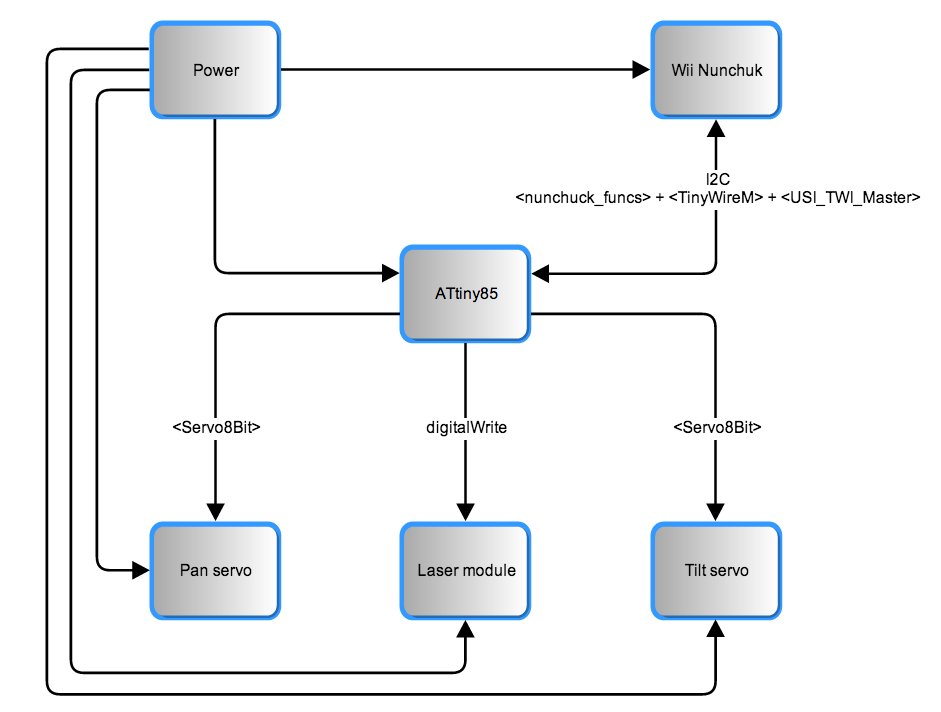
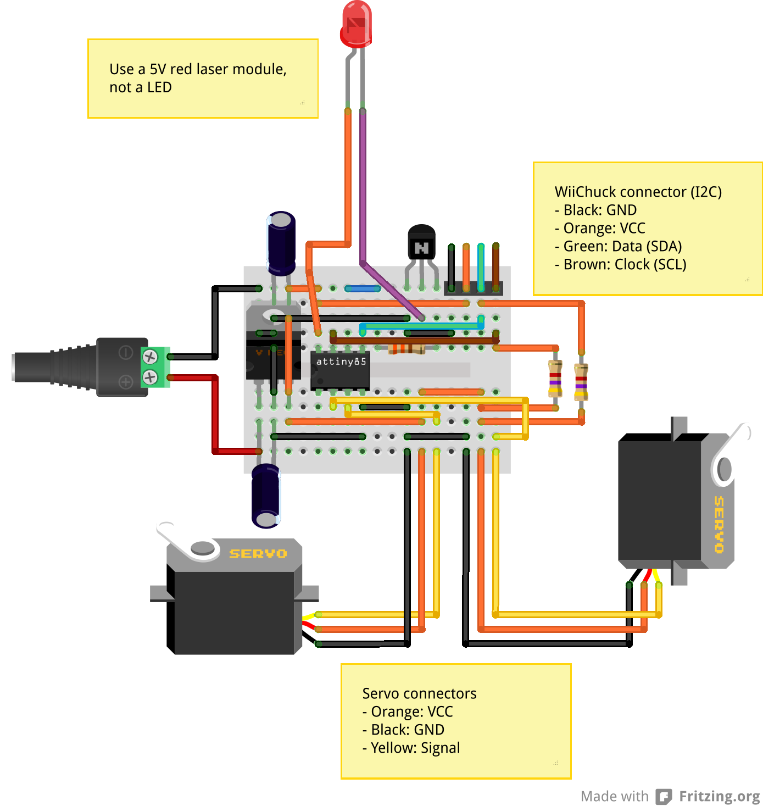
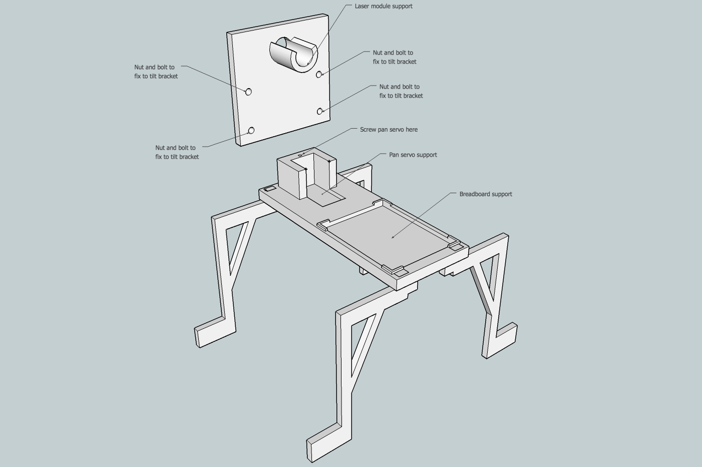
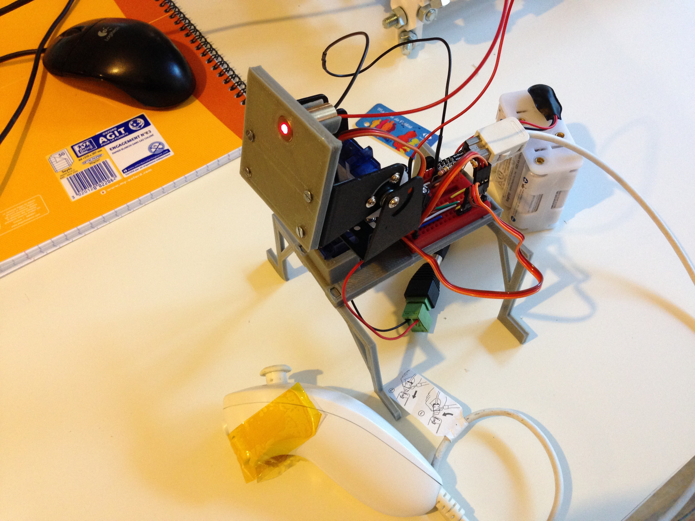
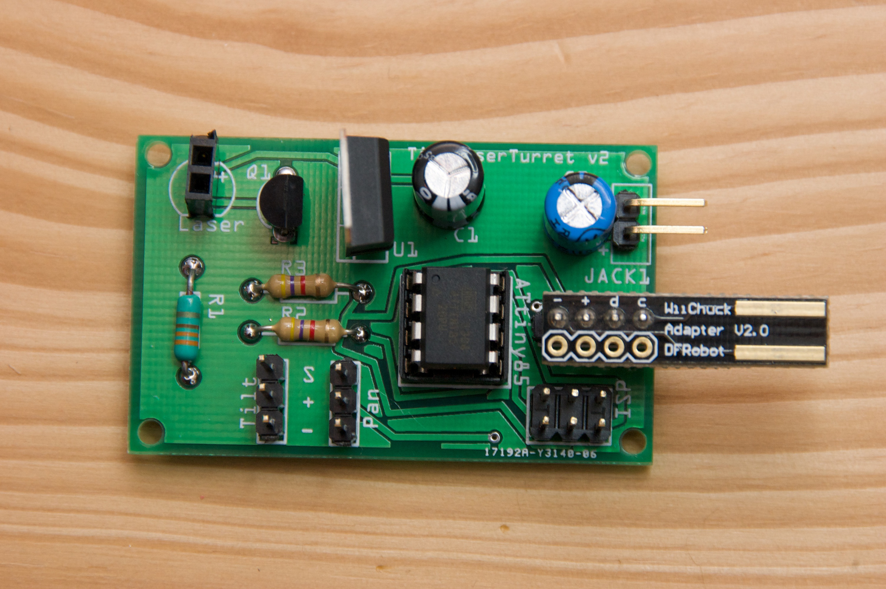

TinyLaserTurret
===============

TinyLaserTurret is a simple ATtiny85 based laser turret, with Nunchuck control.

* [TinyLaserTurret in action](http://www.youtube.com/watch?v=AJifI_-Nt7g)

Requirements
------------

TinyLaserTurret use few items:

* An [ATtiny85](http://www.atmel.com/devices/attiny85.aspx) microcontroller.
* A [5V laser module](http://dx.com/p/genuine-new-wish-5mw-red-laser-module-5v-2-pack-10091).
* A [BCU-81](http://www.alliedelec.com/search/productdetail.aspx?SKU=R1017089) transistor to drive the laser module.
* A 330Ω resistor to drive BCU-81 transistor.
* A [pan & tilt mount with servos](http://dx.com/p/2-9g-servos-bracket-sensor-mount-pan-tilt-kit-for-gyro-translucent-blue-214081) to orient laser module.
* A [L78S05CV](http://www.alliedelec.com/search/productdetail.aspx?SKU=70013915) voltage regulator.
* Two 100 µF capacitors to filter voltage spike.
* Two 4.7kΩ pull-up resistors for I2C lines.
* A [WiiChuck](http://www.dfrobot.com/index.php?route=product/product&product_id=91) adapter.
* A [power](http://www.adafruit.com/products/368) adapter.
* And a 170 points breadboard, batteries, wires and a Wii Nunchuck.

The full bill of materials is available in the file “docs/bom.xlsx”

Optionnaly, you'll need a 3D printer to build the turret.

You can find all the schematics and PCB into “doc/TinyLaserTurret.fzz”, to open with [Fritzing](http://fritzing.org/).

How to use TinyLaserTurret
--------------------------

TinyLaserTurret needs an ATtiny85 controller running at 8MHz. Once you have build the assembly, you have to connect to it:

* Batteries to the power adapter (from 7V to 12V).
* Wii Nunchuck to the WiiChuck adapter.

Then you will be able to control the turret with Nunchuck's analog joystick, and fire the laser with Nunchuck's Z button. And your cat will be happy :)

Wiring diagram
--------------

The breadboard assembly and schematics
--------------------------------------

Building the turret
-------------------

I provide 3D parts to build the turret. These 3D parts were sized for the specified bill of materials. If you use different items, you'll have to adapt the 3D parts. You'll find inside “3d_parts” folder the following files:

* 3d_assembly.skp: 3D file to show how to build the turret.
* 3d_assembly.stl: same as above, for automatic preview from GitHub site.
* laser_support.skp: 3D file of the laser module support.
* laser_support.stl: same as above, to be uploaded to 3D printer.
* leg.skp: 3D file for turret legs.
* leg.stl: same as above, to be uploaded to 3D printer. You'll have to print four of those.
* main_support.skp: 3D file of the main support, where pan & tilt servos and breadboard will be put.
* main_support.stl: same as above, to be uploaded to 3D printer.

“.skp” files were made with [Trimble Sketchup Make 2013](http://www.sketchup.com/download/all)

3D parts are not made for the PCB assembly. I plan to make a specific version later.

Notes
-----
TinyLaserTurret uses third party libraries, which are included with the project:

* [Servo8Bit](http://www.cunningturtle.com/attiny4585-servo-library/): A library which allows ATtiny microcontroller to drive servos.
* [TinyWireM](http://playground.arduino.cc/Code/USIi2c): An I2C library for ATtiny85. 
* [USI_TWI_Master](http://playground.arduino.cc/Code/USIi2c): Universal Serial Interface library for ATtiny85, used by TinyWireM. This library was modified to work with an 8MHz ATtiny85, and support I2C fast mode (400kHz) and standard mode (< 100kHz)
* [nunchuck_funcs](http://todbot.com/blog/2008/02/18/wiichuck-wii-nunchuck-adapter-available/): A library to communicate with Wii Nunchuck. It was modified to work with TinyWireM.

The live assembly
-----------------

